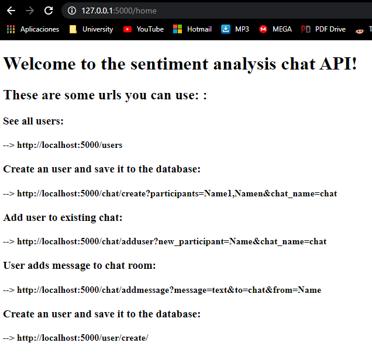
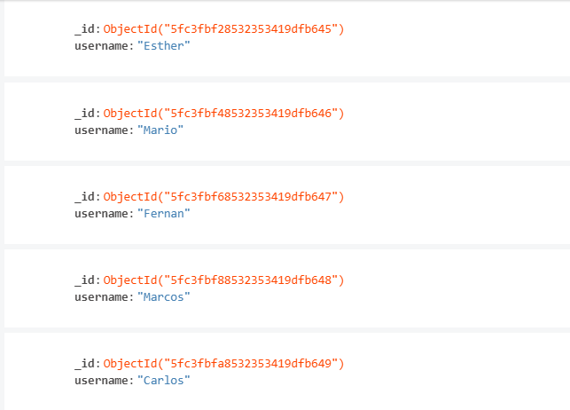
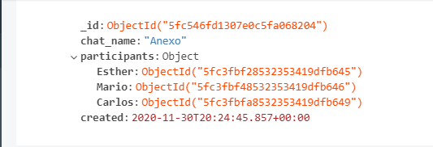
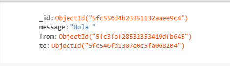

# Chat API

This project aims to create an api that serves as backend for a chat service. The API will allow to save and to ask for different variables in a data base. Besides all of this, they API can also analyze the feeling of a chat room.

## How does it work?
To see an example of how all of this work, go to the API_HowToUse file in the repository. In this jupyter notebook, we show how to API can do what you want.

However, if you want to try it in your own, go to http://127.0.0.1:5000/home. Here you will get some information explaning how it works in the browser.

## Structure of the data base:
For this project we have used MongoDB. There are 3 collections: users, chats and messages.

### Collection users:
It just contains the username and id.

### Collection chats:
It contains the id, chat_name, all the participants and their user_ids and date of creation.

### Collection messages:
It contains the id, message, user_id from the person who sent the message and chat_id from the chat that the person sent it to.

## Possible improvements:
Even though imagination is unlimited, there are lots of functionalities that can be improved. SOme of them are:
* Making the code more consistent as secure, raising errors.
* Trying not to repeat so much code by creating functions.
* Implementing the chat and index templates in the templates folder just as we did with the home route. This will allow to create an interface to enter names and messages.

## References:
- https://docs.mongodb.com/manual/tutorial/model-embedded-one-to-many-relationships-between-documents/
- https://docs.mongodb.com/manual/tutorial/model-referenced-one-to-many-relationships-between-documents/

